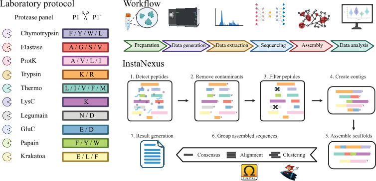

<p align="center">
  
</p>

<p align="center"><em>A de novo protein sequencing workflow</em></p>

<p align="center">
  
  
  
</p>

---

## Table of Contents
- [Introduction](#introduction)
- [Features](#features)
- [Workflow Diagram](#workflow-diagram)
- [Repository Structure](#repository-structure)
- [Getting Started](#getting-started)
- [Prerequisites and Installation](#prerequisites-and-installation)
- [Usage (Coming Soon)](#usage) 
- [License](#license)
- [Acknowledgments](#acknowledgments)
- [References](#references)

---

## Introduction

InstaNexus is a generalizable, end-to-end workflow for direct protein sequencing, tailored to reconstruct full-length protein therapeutics such as antibodies and nanobodies. It integrates AI-driven de novo peptide sequencing with optimized assembly and scoring strategies to maximize accuracy, coverage, and functional relevance.

This pipeline enables robust reconstruction of critical protein regions, advancing applications in therapeutic discovery, immune profiling, and protein engineering.

---

## Features

- 🧬 Supports De Bruijn Graph and Greedy-based assembly
- ⚗️ Handles multiple protease digestions (Trypsin, LysC, GluC, etc.)
- 🧹 Integrated contaminant removal and confidence filtering
- 🧩 Clustering, alignment, and consensus sequence reconstruction
- 🔗 Integrates with external tools:
  - [MMseqs2](https://github.com/soedinglab/MMseqs2) for fast clustering
  - [Clustal Omega](https://www.ebi.ac.uk/Tools/msa/clustalo/) for high-quality alignment
- 📊 Output-ready for downstream analysis and visualization

---

## Workflow Diagram

<p align="center">
  
</p>

---

## Repository Structure

| File / Folder       | Description                                                                  |
|---------------------|------------------------------------------------------------------------------|
| `environment.yml`   | Conda environment definition with required dependencies                      |
| `README.md`         | Project documentation                                                        |
| `src/`              | Core scripts to run the InstaNexus pipeline                                  |
| `notebooks/`        | Jupyter notebooks for visualization and exploration                          |
| `fasta/`            | Known contaminants and example FASTA sequences                               |
| `json/`             | JSON metadata for peptide color coding and analysis                          |
| `input/`            | Example datasets (e.g., BSA, antibody, nanobody)                             |
| `images/`           | Logos and workflow diagrams (PNG, SVG, PDF)                                  |

---

## Getting Started

Follow these steps to clone the repository and set up the environment using Conda:

### 1. Clone the repository

To clone and set up the environment:

```bash
git clone https://github.com/your-username/instanexus.git
cd instanexus
```

### 2. Create the conda environment
```bash
conda env create -f environment.yml
```

### 3. Activate the environment

```bash
conda activate instanexus
```
---

## Prerequisites and Installation

- Python 3.9+
- [Conda](https://docs.conda.io/en/latest/)
- [MMseqs2](https://github.com/soedinglab/MMseqs2)
- [Clustal Omega](https://www.ebi.ac.uk/Tools/msa/clustalo/)

Install MMseqs2 and Clustal Omega using your package manager or follow their official installation instructions.

---

## Usage (Coming Soon)

> [!WARNING]
> These features are currently under development and will be available soon.

### 1. **Basic usage**

This command displays the full list of arguments and options
```bash
python run.py --help
```

### 2. **Available parameters**

```bash
usage: run.py [-h] --mode {dbg,greedy} --input_csv INPUT_CSV --output_folder OUTPUT_FOLDER
              [--contaminants CONTAMINANTS]
              [--conf CONF]
              [--size_threshold SIZE_THRESHOLD]
              [--kmer_size KMER_SIZE]
              [--min_overlap MIN_OVERLAP]
              [--max_mismatches MAX_MISMATCHES]
              [--min_identity MIN_IDENTITY]
              [--protein_fasta PROTEIN_FASTA]
```

Run all steps for DBG or greedy assembly, clustering, alignment, consensus generation, and mapping

```
options:
  -h, --help            show this help message and exit
  --mode {dbg,greedy}   Mode to run the assembly: 'dbg' or 'greedy'
  --input_csv INPUT_CSV
                        Path to the input CSV file for assembly
  --output_folder OUTPUT_FOLDER
                        Path to the output folder for assembly and subsequent steps
  --contaminants CONTAMINANTS
                        Path to the contaminants fasta file to filter peptides, optional
  --conf CONF           Confidence threshold
  --size_threshold SIZE_THRESHOLD
                        Size threshold for contigs and scaffolds
  --kmer_size KMER_SIZE
                        K-mer size for DBG assembly
  --min_overlap MIN_OVERLAP
                        Minimum overlap for greedy assembly
  --protein_fasta PROTEIN_FASTA
                        Path to the protein fasta file for mapping
  --max_mismatches MAX_MISMATCHES
                        Maximum number of mismatches allowed for mapping
  --min_identity MIN_IDENTITY
                        Minimum identity threshold for mapping
```

### 3a. **Example: DBG assembly**

DBG assembly mode:
```bash
python run.py --mode dbg --input_csv ma3.csv --output_folder ma3_dbg --protein_fasta antibodies_normalized.fasta --contaminants contaminants.fasta --conf 0.95 --kmer_size 6 --min_overlap 10 --size_threshold 0 --max_mismatches 8 --min_identity 0.5 
```

### 3b. **Example: Greedy assembly**

Greedy assembly mode:
```bash
python run.py --mode greedy --input_csv ma3.csv --output_folder ma3_dbg --protein_fasta antibodies_normalized.fasta --contaminants contaminants.fasta --conf 0.95 --min_overlap 3 --size_threshold 0 --max_mismatches 8 --min_identity 0.5
```

---

## License

This project is licensed under the [MIT License](LICENSE).

---

## Acknowledgments

InstaNexus was developed at **DTU Biosustain** and **DTU Bioengineering**.

We are grateful to the **DTU Bioengineering Proteomics Core Facility** for maintenance and operation of mass spectrometry instrumentation.

We also thank the **Informatics Platform at DTU Biosustain** for their support during the development and optimization of InstaNexus.

Special thanks to the users and developers of:
- [MMseqs2](https://github.com/soedinglab/MMseqs2)
- [Clustal Omega](https://www.ebi.ac.uk/Tools/msa/clustalo/)

---

## References

1. Hauser, M., et al. **MMseqs2: ultra fast and sensitive sequence searching**. *Nature Biotechnology* 35, 1026–1028 (2016). https://doi.org/10.1038/nbt.3988  
2. Sievers, F., et al. **Fast, scalable generation of high-quality protein multiple sequence alignments using Clustal Omega**. *Molecular Systems Biology* 7, 539 (2011). https://doi.org/10.1038/msb.2011.75
