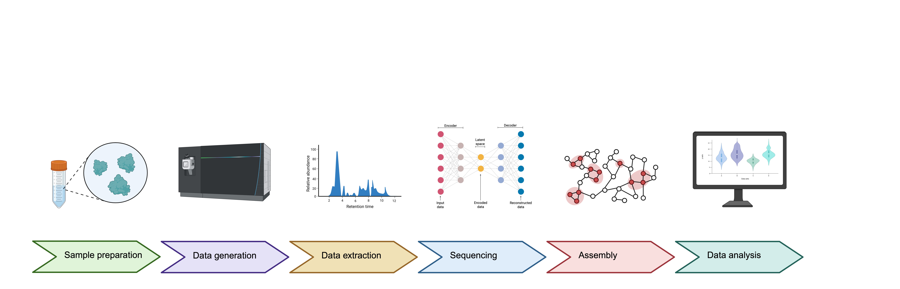

<p align="center">
  
</p>

<p align="center"><em>A de novo peptide assembly workflow</em></p>

<p align="center">
  
  
  
</p>

---

## Table of Contents
- [About](#about)
- [Workflow Diagram](#workflow-diagram)
- [Repository Structure](#repository-structure)
- [Getting Started](#getting-started)
- [Prerequisites and Installation](#prerequisites-and-installation)
- [Command Line Usage](#command-line-usage)
- [Authors](#authors)
- [Acknowledgments](#acknowledgments)
- [License](#license)

---

## About

**InstaNexus** is a flexible and modular **de novo peptide assembly workflow** designed to reconstruct full protein sequences from mass spectrometry-derived peptides. It offers both **De Bruijn Graph (DBG)** and **Greedy** assembly modes, integrates confidence filtering, clustering, alignment and consensus generation.

---

## Workflow Diagram

<p align="center">
  
</p>

---

## Repository Structure

| File / Folder                    | Description                                                                           |
|----------------------------------|---------------------------------------------------------------------------------------|
| `environment.yml`               | Conda environment definition with required dependencies                              |
| `README.md`                     | Project documentation                                                                |
| `src/`                          | Custom scripts to run the workflow                                             |
| `notebooks/`                    | Jupyter notebooks for full or partial analyses                                       |
| `fasta/`                        | FASTA files and known contaminants for filtering                                     |
| `input/`                        | Example datasets: BSA, antibody, nanobody, and mini-binder samples                   |
| `unittests/`                    | Unit test scripts for validating steps                            |
| `images/`                       | Folder containing logo (`logo.svg`) and workflow image (`workflow_diagram.png`)      |

---

## Getting Started

To clone and set up the environment:

```bash
git clone https://github.com/your-username/instanexus.git
cd instanexus
conda create --name assembly --file environment.yml
conda activate assembly
